# 🛡️ Threat Hunt Report – Another Day, Part Two (Nimbus Health Credential Reuse)

---

## 📌 Executive Summary

During a routine credential-exposure sweep, a newly hired Nimbus Health IT Support Technician was found publicly identifiable via LinkedIn, with a breached personal password exposed in credential-stuffing datasets. An external operator reused that credential against the internet-exposed IT support workstation `NH-WKS-IT-01` over RDP, succeeding after only three failed attempts on 28 May 2026. Once on the keyboard, the operator performed local and domain reconnaissance, enumerated the HR group outside the account's role, accessed HR files on `\\NH-FS-01\HR` over SMB, staged and compressed the material locally, and exfiltrated the archive through RDP drive redirection (`\\tsclient`), leaving no malware and no persistence behind. Root cause: password reuse from a public breach combined with a publicly cached internal document advertising the workstation's public RDP endpoint.

---

## 🎯 Hunt Objectives

- Identify malicious activity across endpoints and network telemetry
- Correlate attacker behavior to MITRE ATT&CK techniques
- Document evidence, detection gaps, and response opportunities

---

## 🧭 Scope & Environment

- **Environment:** Nimbus Health Windows estate , single host `NH-WKS-IT-01` (IT administration workstation, public IP 135.237.163.62), domain `corp.nimbushealth.com`
- **Data Sources:** Microsoft Sentinel (`law-cyber-range` workspace) - MDE tables: `DeviceLogonEvents`, `DeviceProcessEvents`, `DeviceFileEvents`, `DeviceEvents`; OSINT artefacts (LinkedIn profile, HIBP report, cached support reference, role matrix)
- **Timeframe:** 2026-05-25 → 2026-05-30

---

## 📚 Table of Contents

- [🧠 Hunt Overview](#-hunt-overview)
- [🧬 MITRE ATT&CK Summary](#-mitre-attck-summary)
- [🔍 Flag Analysis](#-flag-analysis)
- [🚨 Detection Gaps & Recommendations](#-detection-gaps--recommendations)
- [🧾 Final Assessment](#-final-assessment)
- [📎 Analyst Notes](#-analyst-notes)

---

## 🧠 Hunt Overview

This hunt began outside the SIEM. Open-source artefacts showed that Mason Reed, a brand-new IT Support Technician at Nimbus Health, published his role and personal email (`mason.reed@hotmail.com`) on LinkedIn. That address appears in three breaches; the **Synthient Credential Stuffing Threat Data (2025)** exposed recent plaintext passwords, explaining credential reuse. A cached internal "Remote Support Reference" page, indexed by a public document cache, advertised `NH-WKS-IT-01` at public IP `135.237.163.62` with the note "use domain credentials."

Inside the telemetry, the host sits under constant internet brute-force noise (thousands of failures from dozens of IPs, zero successes). One source is different: `116.45.242.115` tried only the `m.reed` account, failed three times, then logged in via **RemoteInteractive (RDP)** on 28 May 2026 ~21:28. After ~2 minutes of first-logon/profile-creation noise, an orientation burst ran: `whoami`, `hostname`, `ipconfig /all`, `whoami /groups`. A second session opened at 21:40:59 from `45.131.194.61` and moved past the role: `net view`, `net view \\NH-FS-01`, `net user /domain`, `net group /domain`, and `net group "NH-HR-Users" /domain`. The operator opened an HR file over SMB, copied HR material into `C:\Users\m.reed\Documents\SupportReview`, compressed it into `support_review_202605.zip`, checked the RDP channel with `net view \\tsclient`, and copied the archive to `\\tsclient\G\Temp\NimbusSupport` , exfiltration through the session already open, with no upload and no cloud touch. No persistence was established; a file deletion inside the burst was OneDrive's own updater cleaning its installer, and the account never executed anything on the file server.

---

## 🧬 MITRE ATT&CK Summary

| Flag | Technique Category | MITRE ID | Priority |
|-----:|-------------------|----------|----------|
| 1 | Gather Victim Identity Information: Employee Names | T1589.003 | Medium |
| 2 | Search Open Websites/Domains: Social Media | T1593.001 | Medium |
| 3 | Gather Victim Identity Information: Email Addresses | T1589.002 | Medium |
| 4 | Search Closed Sources: Purchase Technical Data (breach data) | T1597.002 | High |
| 5 | Search Open Technical Databases (cached internal doc) | T1596 | High |
| 6 | Valid Accounts / Brute Force: Credential Stuffing | T1078 / T1110.004 | Critical |
| 7 | Remote Services: Remote Desktop Protocol | T1021.001 | Critical |
| 8 | Valid Accounts (session from second infrastructure) | T1078 | High |
| 9 | System Owner/User, System Info & Network Config Discovery | T1033 / T1082 / T1016 | Medium |
| 10 | (Benign) Indicator Removal ruled out , application housekeeping | , | Info |
| 11 | Network Share Discovery | T1135 | High |
| 12 | Permission Groups Discovery: Domain Groups | T1069.002 | High |
| 13 | Data from Network Shared Drive | T1039 | Critical |
| 14 | Data Staged: Local Data Staging | T1074.001 | High |
| 15 | Archive Collected Data: Archive via Utility | T1560.001 | High |
| 16 | Exfiltration Over Alternative Protocol , RDP drive redirection | T1048 / T1021.001 | Critical |
| 17 | Persistence , none established (negative finding) | , | Info |
| 18 | Lateral Movement , none to file server (SMB access only) | T1021.002 (access, not execution) | Info |
| 19 | Attribution: external operator on valid account | T1078 | Critical |
| 20 | Credential Stuffing evidenced vs brute force | T1110.004 | High |

---

## 🔍 Flag Analysis

_All flags below are collapsible for readability._

---

<details>
<summary id="-flag-1">🚩 <strong>Flag 1: The Account Under Review</strong></summary>

### 🎯 Objective
Identify which Nimbus account the intrusion targeted.

### 📌 Finding
**`m.reed`** , Mason Reed, IT Support Technician, new hire (2026-04-28), Standard User entitled only to the IT workstation and IT share.

### 🔍 Evidence

| Field | Value |
|------|-------|
| Host | NH-WKS-IT-01 |
| Account | m.reed |
| Source | Role matrix (Artefact 04) + targeted logon pattern in DeviceLogonEvents |

### 💡 Why it matters
New starters onboarded quickly during growth are prime OSINT targets; this account's entitlements define the abuse baseline for the rest of the hunt.

### 🔧 KQL Query Used
```kql
DeviceLogonEvents
| where Timestamp between (datetime(2026-05-25) .. datetime(2026-05-31))
| where DeviceName startswith "nh-wks-it-01"
| summarize Attempts=count(), Successes=countif(ActionType=="LogonSuccess") by AccountName, RemoteIP, LogonType
| order by Attempts desc
```

### 🖼️ Screenshot
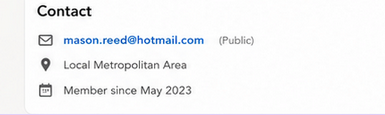

### 🛠️ Detection Recommendation
**Hunting Tip:** Baseline logon sources per account; alert when a single account is targeted by a low-volume external source distinct from spray noise.

</details>

---

<details>
<summary id="-flag-2">🚩 <strong>Flag 2: His Public Role</strong></summary>

### 🎯 Objective
Establish what the target voluntarily published.

### 📌 Finding
LinkedIn lists his title as **`IT Support Technician`** at Nimbus Health (started Apr 2026, ~1 mo).

### 🔍 Evidence

| Field | Value |
|------|-------|
| Source | LinkedIn profile (Artefact 01) |
| Profile URL | www.linkedin.com/in/mason-reed-it |

### 💡 Why it matters
The title told an attacker this account likely had elevated reach on IT systems and would be plausible on the IT support workstation.

### 🖼️ Screenshot
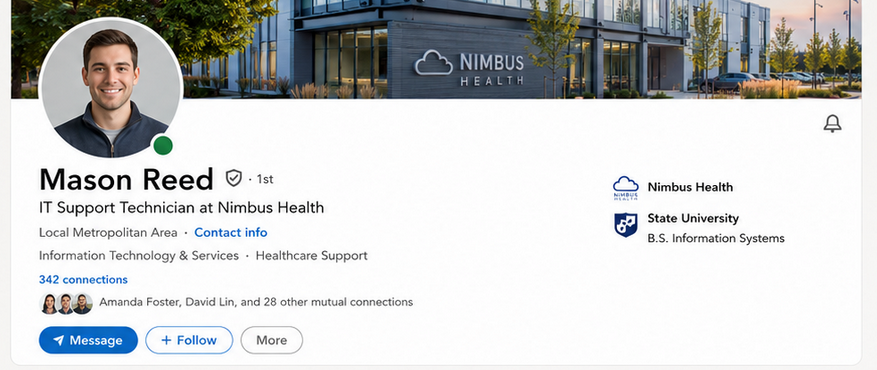

### 🛠️ Detection Recommendation
**Hunting Tip:** Include new-hire OSINT exposure review in onboarding for privileged/IT roles.

</details>

---

<details>
<summary id="-flag-3">🚩 <strong>Flag 3: The Personal Address</strong></summary>

### 🎯 Objective
Find the pivot from a name to searchable breach data.

### 📌 Finding
Public contact email on the profile: **`mason.reed@hotmail.com`** , personal, not corporate.

### 🔍 Evidence

| Field | Value |
|------|-------|
| Source | LinkedIn Contact section (Artefact 01) |

### 💡 Why it matters
A personal address is what breach-lookup services key on; publishing it links personal breach history to a corporate identity.

### 🖼️ Screenshot
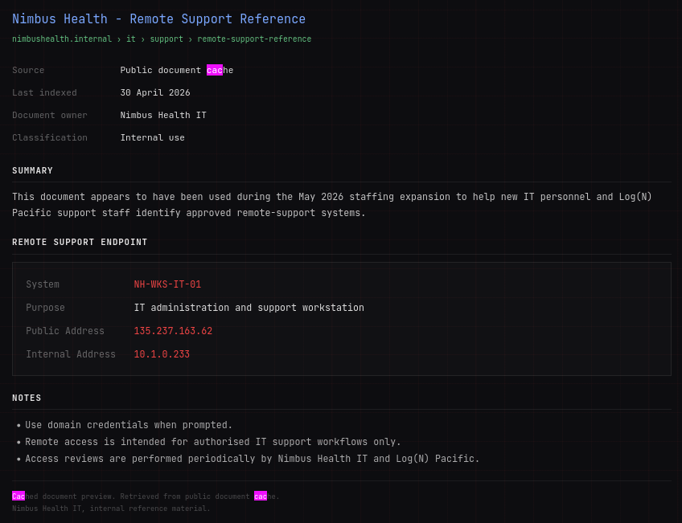

### 🛠️ Detection Recommendation
**Hunting Tip:** Monitor corporate identities against breach-notification services using both corporate and known personal addresses.

</details>

---

<details>
<summary id="-flag-4">🚩 <strong>Flag 4: Which Breach Explains the Reuse</strong></summary>

### 🎯 Objective
Determine which exposure actually handed over a working password.

### 📌 Finding
**Synthient Credential Stuffing Threat Data (Apr 2025)** , recent plaintext email:password pairs built for reuse. MySpace (2008) cannot realistically work today: ~18-year-old partial SHA1 hashes of truncated, lowercased passwords.

### 🔍 Evidence

| Field | Value |
|------|-------|
| Source | HIBP report (Artefact 02) |
| Breaches | Synthient (2025, plaintext), Combolists Telegram (2024, plaintext), MySpace (2008, partial hashes) |

### 💡 Why it matters
Age and format of leaked data determine attacker utility; recent plaintext credential-stuffing data directly explains a three-try success.

### 🖼️ Screenshot
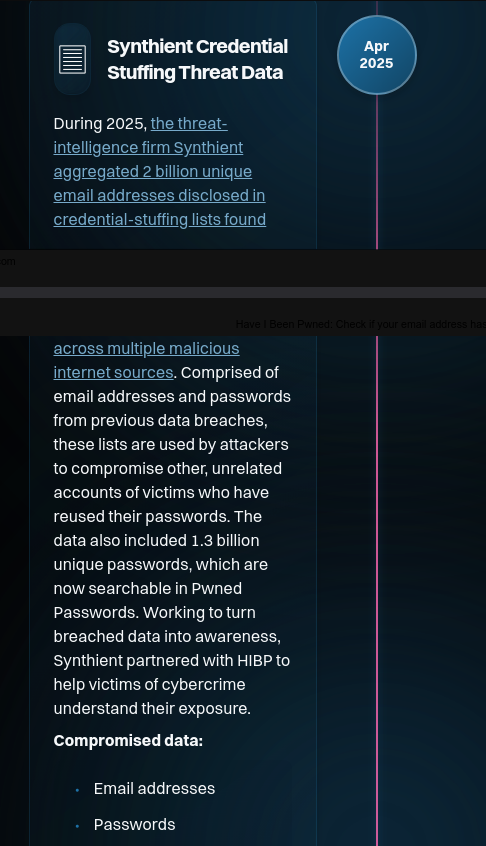
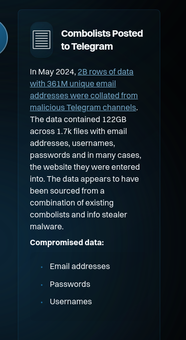
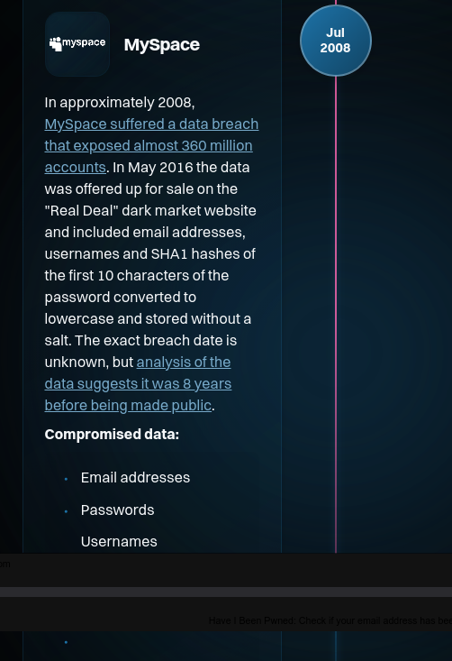

### 🛠️ Detection Recommendation
**Hunting Tip:** Screen new-hire credentials against known-breached password corpora at onboarding and password change.

</details>

---

<details>
<summary id="-flag-5">🚩 <strong>Flag 5: The Remote Support Endpoint</strong></summary>

### 🎯 Objective
Identify how the attacker knew which machine to target.

### 📌 Finding
A cached internal "Remote Support Reference" in a public document cache named `NH-WKS-IT-01` at public IP **`135.237.163.62`**, with the note "Use domain credentials when prompted."

### 🔍 Evidence

| Field | Value |
|------|-------|
| Source | Cached support reference (Artefact 03), indexed 30 Apr 2026 |
| Host | NH-WKS-IT-01 (10.1.0.233 internal) |

### 💡 Why it matters
This converted a stolen credential into an intrusion: identity + password + reachable endpoint.

### 🖼️ Screenshot
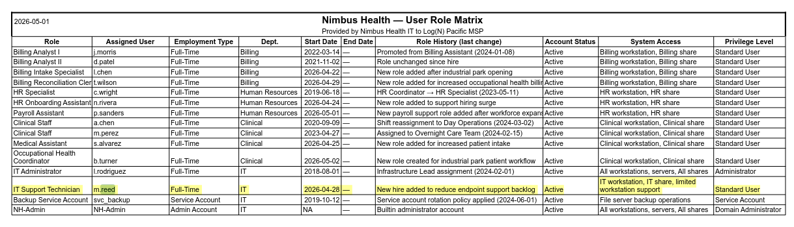

### 🛠️ Detection Recommendation
**Hunting Tip:** Periodically search public caches/archives for internal hostnames, IPs, and doc paths; remove and rotate anything found.

</details>

---

<details>
<summary id="-flag-6">🚩 <strong>Flag 6: The Guessing Source</strong></summary>

### 🎯 Objective
Separate the deliberate intrusion source from internet spray noise.

### 📌 Finding
**`116.45.242.115`** , targeted only `m.reed`, low volume, failed then succeeded. Background: dozens of IPs spraying admin/test/root usernames, thousands of failures, zero successes.

### 🔍 Evidence

| Field | Value |
|------|-------|
| Host | NH-WKS-IT-01 |
| Pattern | m.reed only: 3 failures → success (Network + RemoteInteractive) |

### 💡 Why it matters
Patient, single-account, eventually-successful sources are the signal inside brute-force noise.

### 🔧 KQL Query Used
```kql
DeviceLogonEvents
| where Timestamp between (datetime(2026-05-25) .. datetime(2026-05-31))
| where DeviceName startswith "nh-wks-it-01" and AccountName =~ "m.reed"
| project Timestamp, ActionType, LogonType, RemoteIP
| order by Timestamp asc
```

### 🖼️ Screenshot
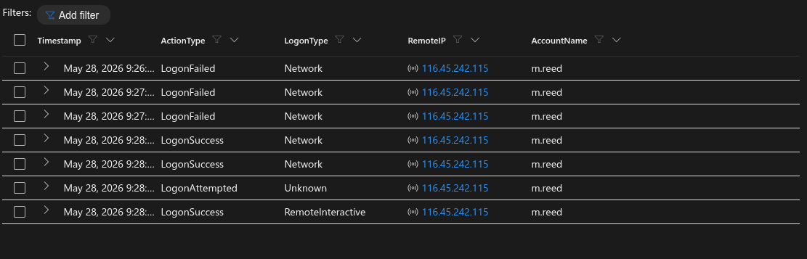

### 🛠️ Detection Recommendation
**Hunting Tip:** Alert on first-ever successful external logon for an account, and on failure→success sequences from a single new source.

</details>

---

<details>
<summary id="-flag-7">🚩 <strong>Flag 7: How They Came In</strong></summary>

### 🎯 Objective
Establish session type.

### 📌 Finding
Logon type **`RemoteInteractive`** , an RDP session, not a local console logon and not plain network authentication.

### 🔍 Evidence

| Field | Value |
|------|-------|
| Host | NH-WKS-IT-01 |
| Timestamp | 2026-05-28 ~21:28 |
| Corroboration | rdpclip.exe / TSTheme.exe at session start |

### 💡 Why it matters
RDP gives full keyboard control and, critically, opens the drive-redirection channel later used for exfiltration.

### 🖼️ Screenshot
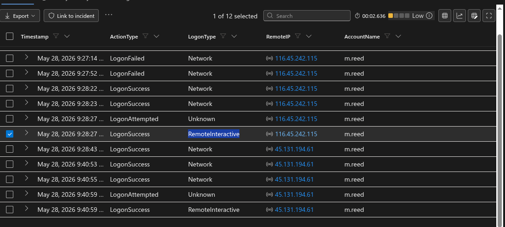

### 🛠️ Detection Recommendation
**Hunting Tip:** Alert on any RemoteInteractive logon to internet-exposed hosts from non-corporate IP space.

</details>

---

<details>
<summary id="-flag-8">🚩 <strong>Flag 8: The Second Source</strong></summary>

### 🎯 Objective
Track operator infrastructure changes.

### 📌 Finding
Second external source: **`45.131.194.61`** , same account, new RDP session at 21:40:59, 28 May 2026.

### 🔍 Evidence

| Field | Value |
|------|-------|
| Host | NH-WKS-IT-01 |
| Sessions | 116.45.242.115 (21:28) → 45.131.194.61 (21:40:59) |

### 💡 Why it matters
Infrastructure switching mid-operation indicates a deliberate external operator, not a confused employee.

### 🖼️ Screenshot
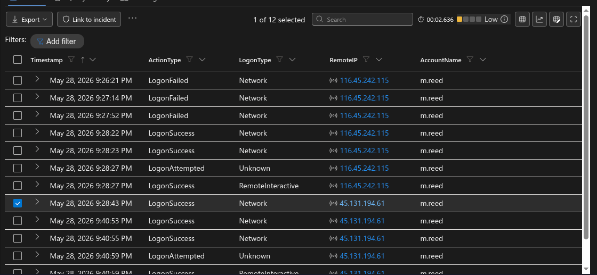

### 🛠️ Detection Recommendation
**Hunting Tip:** Alert when one account authenticates from multiple distinct external ASNs within a short window.

</details>

---

<details>
<summary id="-flag-9">🚩 <strong>Flag 9: Getting Their Bearings</strong></summary>

### 🎯 Objective
Reconstruct the orientation burst, anchored on the first real command.

### 📌 Finding
Session opened 21:28:29; ~2 min of first-logon housekeeping (userinit, profile creation, first-run apps) followed. First real command 21:30:14. Burst, in order:
**`whoami, hostname, ipconfig /all, whoami /groups`**

### 🔍 Evidence

| Field | Value |
|------|-------|
| Host | NH-WKS-IT-01 |
| Timestamps | 21:30:14 → 21:31:04 |
| Parent | cmd.exe (21:30:09) |

### 💡 Why it matters
Anchoring on session open would misattribute Windows/Edge first-run noise to the operator; the burst is classic who/where/what-can-I-do discovery.

### 🖼️ Screenshot
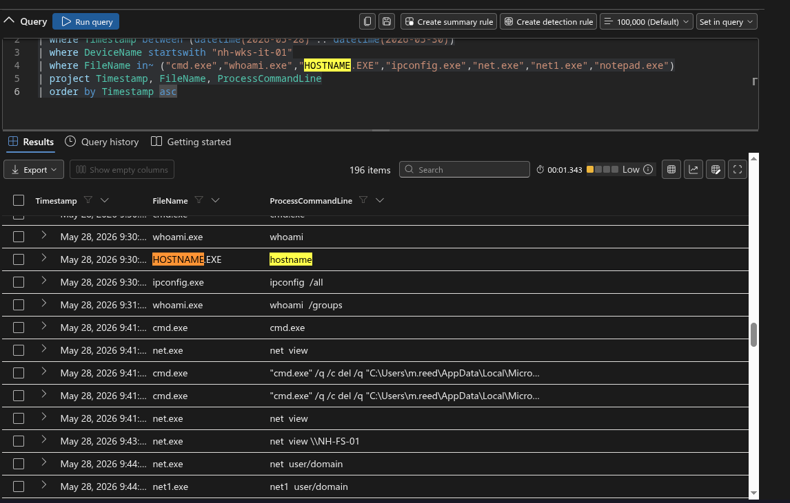

### 🛠️ Detection Recommendation
**Hunting Tip:** Detect discovery-command clusters (whoami+hostname+ipconfig within minutes) under a fresh RemoteInteractive session.

</details>

---

<details>
<summary id="-flag-10">🚩 <strong>Flag 10: Signal or Noise</strong></summary>

### 🎯 Objective
Classify a file deletion inside the burst window.

### 📌 Finding
**Not the operator , machine housekeeping.** `cmd.exe /q /c del ... OneDriveSetup.exe`: OneDrive's own updater deleting its installer after first-run setup.

### 🔍 Evidence

| Field | Value |
|------|-------|
| Timestamp | 21:41:16 |
| Command Line | `cmd.exe /q /c del /q "C:\Users\m.reed\AppData\Local\Microsoft\OneDrive\Update\OneDriveSetup.exe"` |

### 💡 Why it matters
Not every deletion is anti-forensics; misreading routine cleanup as cover-up corrupts the narrative and the report.

### 🖼️ Screenshot
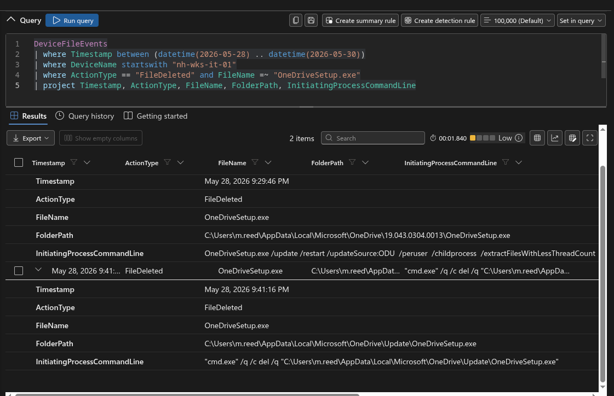

### 🛠️ Detection Recommendation
**Hunting Tip:** Whitelist known application self-cleanup patterns before alerting on deletions in user profiles.

</details>

---

<details>
<summary id="-flag-11">🚩 <strong>Flag 11: Looking at the File Server</strong></summary>

### 🎯 Objective
Identify remote share reconnaissance.

### 📌 Finding
**`net view \\NH-FS-01`** at 21:43:19 , asking the file server what it shares.

### 🔍 Evidence

| Field | Value |
|------|-------|
| Process | net.exe |
| Command Line | `net view \\NH-FS-01` |

### 💡 Why it matters
Recon moved off-host toward the estate's data store, preceding cross-department access.

### 🖼️ Screenshot


### 🛠️ Detection Recommendation
**Hunting Tip:** Alert on net view/net share against file servers from workstations outside admin change windows.

</details>

---

<details>
<summary id="-flag-12">🚩 <strong>Flag 12: Who Is In HR</strong></summary>

### 🎯 Objective
Identify enumeration beyond the account's role.

### 📌 Finding
**`net group "NH-HR-Users" /domain`** at 21:46:23 , an IT support account enumerating HR group membership, read verbatim from the log line.

### 🔍 Evidence

| Field | Value |
|------|-------|
| Process | net.exe / net1.exe |
| Command Line | `net group "NH-HR-Users" /domain` |

### 💡 Why it matters
This is the first clear step outside role entitlement , targeting HR before touching HR data.

### 🖼️ Screenshot


### 🛠️ Detection Recommendation
**Hunting Tip:** Alert on domain group enumeration of sensitive groups (HR, Finance, DA) from non-admin accounts.

</details>

---

<details>
<summary id="-flag-13">🚩 <strong>Flag 13: Crossing the Line</strong></summary>

### 🎯 Objective
Identify out-of-role data access.

### 📌 Finding
Opened HR file **`access_request_queue_20260526.csv`** from `\\NH-FS-01\HR\2026-05\AccessRequests\` via notepad at 21:50:56. Role matrix grants m.reed the IT share only.

### 🔍 Evidence

| Field | Value |
|------|-------|
| Command Line | `notepad \\NH-FS-01\HR\2026-05\AccessRequests\access_request_queue_20260526.csv` |

### 💡 Why it matters
Definitive role violation: HR share contents read by an IT support account over the network.

### 🖼️ Screenshot


### 🛠️ Detection Recommendation
**Hunting Tip:** Map share ACLs to roles and alert on first-time cross-department share access per account.

</details>

---

<details>
<summary id="-flag-14">🚩 <strong>Flag 14: Where They Put It</strong></summary>

### 🎯 Objective
Locate the staging folder.

### 📌 Finding
**`C:\Users\m.reed\Documents\SupportReview`** , HR material copied in via cmd.exe between 21:53 and 21:55 (access_request_queue_20260526.csv, employee_record_EMP-87291_20260527.txt, access_review_notes_20260528.txt).

### 🔍 Evidence

| Field | Value |
|------|-------|
| ActionType | FileCreated (x3) |
| Initiator | cmd.exe |

### 💡 Why it matters
An innocuous, role-plausible folder name ("SupportReview") used to blend collection into normal work.

### 🖼️ Screenshot


### 🛠️ Detection Recommendation
**Hunting Tip:** Detect cmd/robocopy copies from cross-department UNC paths into user profile folders.

</details>

---

<details>
<summary id="-flag-15">🚩 <strong>Flag 15: The Archive</strong></summary>

### 🎯 Objective
Identify the compression artifact.

### 📌 Finding
**`support_review_202605.zip`** created by powershell.exe at 21:55:27 in `C:\Users\m.reed\Documents\`.

### 🔍 Evidence

| Field | Value |
|------|-------|
| ActionType | FileCreated |
| Initiator | powershell.exe (Compress-Archive) |

### 💡 Why it matters
Compression of staged cross-department data marks the transition from collection to exfiltration.

### 🖼️ Screenshot


### 🛠️ Detection Recommendation
**Hunting Tip:** Alert on archive creation by PowerShell in user profiles shortly after cross-share file copies.

</details>

---

<details>
<summary id="-flag-16">🚩 <strong>Flag 16: How It Left</strong></summary>

### 🎯 Objective
Determine the exfiltration channel.

### 📌 Finding
The archive was copied to **`\\tsclient\G\Temp\NimbusSupport`** at 21:57:17 , the attacker's own drive, mapped into the session via **RDP drive redirection**. No upload, no cloud service, no conventional network exfil to query.

### 🔍 Evidence

| Field | Value |
|------|-------|
| ActionType | FileCreated |
| Path | `\\tsclient\G\Temp\NimbusSupport\support_review_202605.zip` |
| Initiator | cmd.exe |

### 💡 Why it matters
The data walked out through the channel already open; defenders watching only egress/web proxies would see nothing.

### 🖼️ Screenshot


### 🛠️ Detection Recommendation
**Hunting Tip:** Alert on any file writes to `\\tsclient\*` paths; disable RDP drive redirection where not required.

</details>

---

<details>
<summary id="-flag-17">🚩 <strong>Flag 17: What They Left Behind</strong></summary>

### 🎯 Objective
Prove or disprove persistence.

### 📌 Finding
**No persistence established by the operator.** Scheduled tasks, services and autoruns present across the window all belong to legitimate Windows and application defaults , Edge/OneDrive updaters, Defender/MDE, Windows Update maintenance. Access depends entirely on the stolen password.

### 💡 Why it matters
A negative finding must be evidenced: every entry accounted for, none operator-created. Containment can therefore focus on credentials and the exposed RDP path.

### 🖼️ Screenshot


### 🛠️ Detection Recommendation
**Hunting Tip:** Baseline autoruns per host; diff against the golden set during IR rather than eyeballing.

</details>

---

<details>
<summary id="-flag-18">🚩 <strong>Flag 18: Where They Actually Sat</strong></summary>

### 🎯 Objective
Confirm single-host scope.

### 📌 Finding
**No** , the account never executed anything on NH-FS-01. HR material was reached **over SMB from NH-WKS-IT-01** (UNC access to `\\NH-FS-01\HR`, files opened remotely and copied locally). One machine, not two.

### 💡 Why it matters
No lateral execution means file-server forensics can stand down; the compromise footprint is one workstation plus share-level data access.

### 🖼️ Screenshot


### 🛠️ Detection Recommendation
**Hunting Tip:** Corroborate share access claims with process telemetry on the server before declaring lateral movement.

</details>

---

<details>
<summary id="-flag-19">🚩 <strong>Flag 19: The Honest Read</strong></summary>

### 🎯 Objective
Attribute correctly and rule out alternatives.

### 📌 Finding
**An external attacker driving a valid stolen account over RDP** from `116.45.242.115` then `45.131.194.61` , not Mason Reed. **Ruling out malware:** nothing was ever dropped or executed beyond built-in Windows commands; no tooling, no persistence. **Ruling out a genuine insider:** external source IPs, off-hours failed-then-successful logons, infrastructure switching, and a breach-exposed reused password fully explain the access without Reed at any keyboard.

### 💡 Why it matters
Calling this "a curious new starter" would burn an innocent employee and leave the actual attack path , credential reuse against an exposed endpoint , wide open.

### 🖼️ Screenshot


### 🛠️ Detection Recommendation
**Hunting Tip:** Treat "insider" conclusions as unproven until source IP, timing, and credential-exposure context are examined.

</details>

---

<details>
<summary id="-flag-20">🚩 <strong>Flag 20: The Guessing Pattern</strong></summary>

### 🎯 Objective
Evidence credential reuse over brute force.

### 📌 Finding
From 116.45.242.115: **3 failed logons, then a success**. Brute force requires volume , the background spray on this host threw thousands of guesses from dozens of IPs and never succeeded once. Three tries then a valid logon means the password was already held: reused from the Synthient credential-stuffing breach of his personal email.

### 💡 Why it matters
The failure-to-success ratio is the fingerprint distinguishing credential stuffing (T1110.004) from brute force (T1110.001), which changes both root cause and remediation.

### 🖼️ Screenshot


### 🛠️ Detection Recommendation
**Hunting Tip:** Alert on ≤5 failures followed by success from a previously unseen external source , the signature of a tested credential.

</details>

---

## 🚨 Detection Gaps & Recommendations

### Observed Gaps
- RDP exposed directly to the internet on an IT workstation (135.237.163.62), advertised by a publicly cached internal document
- No alerting on failure→success logons from new external sources, or on multi-ASN authentication for one account
- RDP drive redirection enabled and unmonitored , `\\tsclient` writes generated no detection
- No breached-password screening at onboarding; personal-password reuse reached the domain
- Cross-department share access (IT account → HR share) raised no alarm; share ACLs broader than the role matrix

### Recommendations
- Remove public RDP exposure; require VPN + MFA for all remote access; disable drive redirection where not needed
- Enforce breached-password checks (e.g., against Pwned Passwords) at set/reset; MFA on all accounts
- Alert on RemoteInteractive logons from external IPs, discovery-command bursts, sensitive-group enumeration, and `\\tsclient\*` file writes
- Align share ACLs to the role matrix; review access whenever hiring surges add users to shared workstations
- Sweep public caches/archives for leaked internal documentation; rotate anything exposed

---

## 🧾 Final Assessment

A low-sophistication but well-prepared external operator compromised Nimbus Health using nothing but public information: a LinkedIn profile, a breached personal password, and a cached internal document pointing at an exposed RDP endpoint. Inside, they used only built-in Windows tooling , discovery, cross-role SMB access to HR data, local staging, PowerShell compression, and exfiltration through RDP drive redirection , leaving no malware and no persistence. Impact is a confirmed exfiltration of HR/employee personal data, triggering breach-notification obligations. Containment: disable the account, cut the external RDP path, block both source IPs, and reset credentials , a password reset alone is insufficient while the exposure remains. Defensive posture failures were architectural (exposure, redirection, ACLs) rather than tooling: telemetry captured the entire chain, but nothing was watching.

---

## 📎 Analyst Notes

- Report structured for interview and portfolio review
- Evidence reproducible via advanced hunting in the `law-cyber-range` Sentinel workspace (25–30 May 2026, `DeviceName startswith "nh-wks-it-01"`)
- Techniques mapped directly to MITRE ATT&CK
- Two findings are evidenced negatives (no persistence; no file-server execution) , the quiet tables were accounted for, not assumed

---
